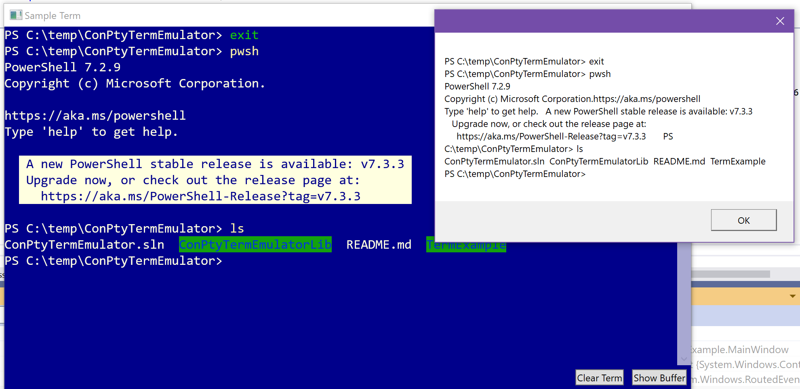

## Simple example library/control/test app for the Windows Terminal WPF Control and the new ConPTY Library.



Note if you give an invalid executable for the shell start or if your OpenConsole.exe is not in the right place you will get a crash on start.

Make sure your output looks like:

```
./ConPtyTermEmulatorLib.dll
./ConPtyTermEmulatorLib.pdb
./Microsoft.Terminal.Wpf.dll
./Microsoft.Terminal.Wpf.pdb
./Microsoft.Terminal.Wpf.xml
./PublicTerminalCore.dll
./runtimes
./runtimes/win10-x64
./runtimes/win10-x64/native
./runtimes/win10-x64/native/conpty.dll
./runtimes/win10-x64/native/OpenConsole.exe
./TermExample.deps.json
./TermExample.dll
./TermExample.exe
./TermExample.pdb
./TermExample.runtimeconfig.json
```

To accomplish this I did change the nuget package structure to still be able to use a package.

You will need `PublicTerminalCore.dll` and `Microsoft.Terminal.Wpf.dll` from the Terminal build as well.  Place them in `ConPtyTermEmulatorLib/lib` and `ConPtyTermEmulatorLib/runtimes/win10-x64/native` respectively.

You do not need to create a nuget package but can just manually copy all the dlls/exes to the final build location paths above if desired.

There are airspace issues (you cannot put anything above the terminal control).  I could not get the ConPTY term to be in win32-input-mode.  From what I read setting `PSEUDOCONSOLE_WIN32_INPUT_MODE` for the flags in `CreatePseudoConsole` should work but powershell would crash.